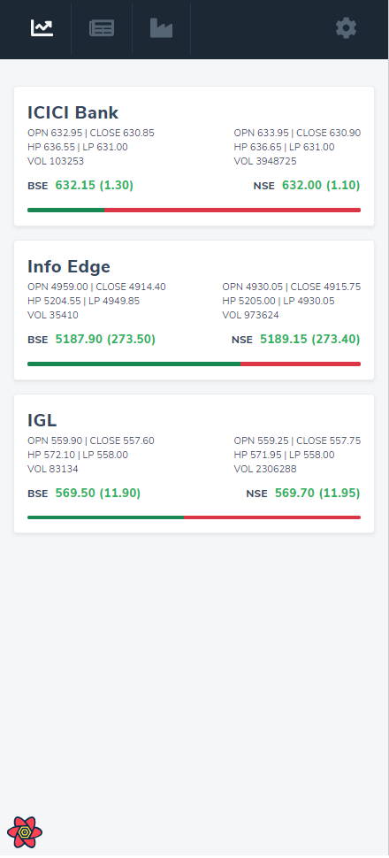

<!-- PROJECT LOGO -->
 

  
  <h3 align="center">App - Stock Market Tracker - 25DMPD - [In Development]</h3>
  

    This is my first project on Github, and it is quite fun.
  

<!-- ABOUT THE PROJECT -->
## About The Project
The idea behind this project is to track the stock prices UP and DOWN and collect news, make the relation between news and price, and find out why the prices are changing. 

### Key features 
* See all prices info on one page.

### Built With

This section should list any major frameworks that you built your project using. Leave any add-ons/plugins for the acknowledgements section. Here are a few examples.
* [React JS](https://reactjs.org)
* [Node JS](https://nodejs.org/en)
* [Express](http://expressjs.com)
* [Bootstrap](https://react-bootstrap.github.io)
* [MySQL](https://www.mysql.com)

### First Look

